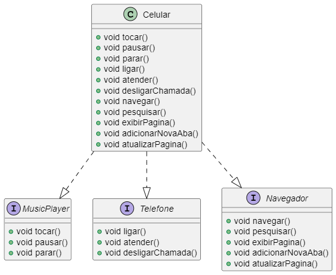

# Projeto Celular com UML

Este projeto implementa uma classe `Celular` que possui funcionalidades de um player de música, telefone e navegador. A classe `Celular` implementa as interfaces `MusicPlayer`, `Telefone` e `Navegador`.

## Estrutura do Projeto

- `Celular.java`: Classe que implementa as interfaces `MusicPlayer`, `Telefone` e `Navegador`.
- `MusicPlayer.java`: Interface que define métodos para tocar, pausar e parar músicas.
- `Telefone.java`: Interface que define métodos para ligar, atender e desligar chamadas.
- `Navegador.java`: Interface que define métodos para navegar, pesquisar, exibir páginas, adicionar novas abas e atualizar páginas.
- `modelo.puml`: Diagrama UML que representa a estrutura do projeto.

## Diagrama UML

O diagrama UML (`modelo.puml`) mostra a relação entre a classe `Celular` e as interfaces `MusicPlayer`, `Telefone` e `Navegador`.

